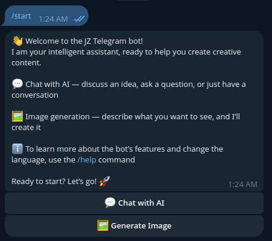
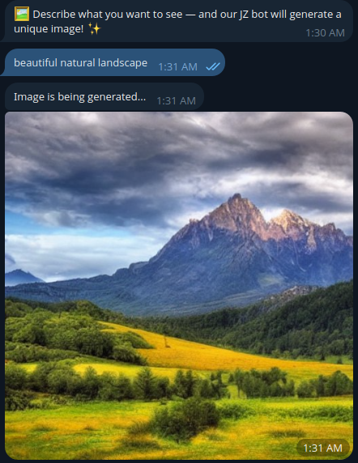

# Telegram Bot with AI Mistral API and Stable Diffusion (Hugging Face)

<p align="center">
  

<p align="center">
  <a href="https://t.me/JZ_AI_bot" target="_blank">
    
  </a>
</p>

[](https://github.com/aiogram/aiogram)
[](https://t.me/progaem_rebiatky_1098)


#### A powerful Telegram bot built on [aiogram](https://github.com/aiogram/aiogram) combining advanced AI chat and image generation. The bot supports multiple languages and user feedback collection.

## 🚀 Features

1. 💬 **Chat with AI** — converse with AI via the [Mistral API](https://mistral.ai/).
2. 🎨 **Image Generation** — generate images from text prompts using **Stable Diffusion** via the `StableDiffusionPipeline` from the [diffusers](https://github.com/huggingface/diffusers) library and [Hugging Face](https://huggingface.co/).
3. 🌍 **Interface Localization** — multi-language support via gettext. Available languages:
   - 🇺🇸 English (en)
   - 🇷🇺 Russian (ru)
   - 🇪🇸 Spanish (es)
   - 🇫🇷 French (fr)
4. 📝 **Request and Feedback Logging** — the bot saves user requests and enables feedback for bugs and feature suggestions.

## 📸 Screenshots

<p align="center">
  
  
  
</p>

<p align="center">
  
  
  
</p>


## ⚙️ Quick Start

### 1. Clone the repository

```bash
git clone https://github.com/yourusername/yourbotname.git
cd yourbotname
```

### 2. Install dependencies

It is recommended to use a virtual environment:

```bash
python -m venv venv
source venv/bin/activate  # or .\venv\Scripts\activate on Windows
pip install -r requirements.txt
```

### 3. Configure environment variables

Create a .env file or set environment variables:

```bash
BOT_TOKEN="your-telegram-bot-token-here"
MISTRAL_AI_TOKEN="your-mistral-ai-token-here"
HUGGING_FACE_TOKEN="your-huggingface-api-token-here"
```

### 4. Run the bot

```bash
python main.py
```

### 🗂 Project Structure

```
├── bot/
│   ├── api/           # AI API integrations (Mistral)
│   ├── config/        # Configuration loading (gettext, logger) and environment variables
│   ├── db/            # Database creation, models, and DB interaction functions
│   ├── generation/    # Image generation (Stable Diffusion)
│   ├── handlers/      # Message handlers
│   ├── keyboard/      # Inline button creation
│   ├── locales/       # Localization files (.po/.mo)
│   ├── logs/          # Logging
│   └── states/        # FSM states
├── .env.template      # Example env file
├── bot_init.py        # Bot and dispatcher initialization
├── main.py            # Entry point (bot launch)
├── requirements.txt   # Dependencies
└── README.md          # Project documentation
```

## 📋 How to Use

####After pressing the /start or /menu command, the bot will send a message offering two options:
 - Chat with AI 💬
 - Generate Image 🖼️

### 1. Chat with AI

After pressing the 💬 Chat with AI button, send any message and the bot will reply using the Mistral API capabilities.

### 2. Image Generation

After pressing the 🖼️ Generate Image button, send a message with your generation request. The bot will process the request and return an image.

### 3. Localization

The bot interface will be displayed in the language set in your Telegram settings. Supported languages:
  - 🇺🇸 English (en)
  - 🇷🇺 Russian (ru)
  - 🇪🇸 Spanish (es)
  - 🇫🇷 French (fr)

You can change the language by sending the /help command and pressing the button with your preferred language.

### 4. Sending Feedback

To send feedback or report a bug, send the /help command and press the 📩 Leave feedback or report an issue button.
After pressing the button, write your feedback or describe the issue and the bot will save this information to the database.

----

## 🌍 Adding New Languages

Add `.po`/`.mo` files to `bot/locales/` and update the code to register the new language.


## 🛠️ Сhange the generation model 

1. **Сhange the image generation model used by the bot.**  
To do this, obtain access to any suitable model on [Hugging Face models](https://huggingface.co/models), then specify the new model name and your Hugging Face token in the `bot/generation/image_generation.py` file.
Сurrent model for image generation: `runwayml/stable-diffusion-v1-5`

2. **Сhange the AI text generation model used by the bot.**  
To do this, obtain access to a different model via [Mistral API documentation](https://docs.mistral.ai/) or another provider supported by the [Mistral API](https://mistral.ai/), then specify the new model name and your API token in the `bot/api/api_requests` file.
Сurrent model for text generation: `mistral-large-latestv`


## License
Distributed under the MIT License. See the [LICENSE](./LICENSE) file for details.


## Contact
- 💬 Telegram: [@progaem_1098](https://t.me/progaem_1098)  
- 📢 Telegram Channel: [IT_Python_ZheglY](https://t.me/IT_Python_ZheglY)  
- 🐙 GitHub: [ZheglY](https://github.com/ZheglY)
